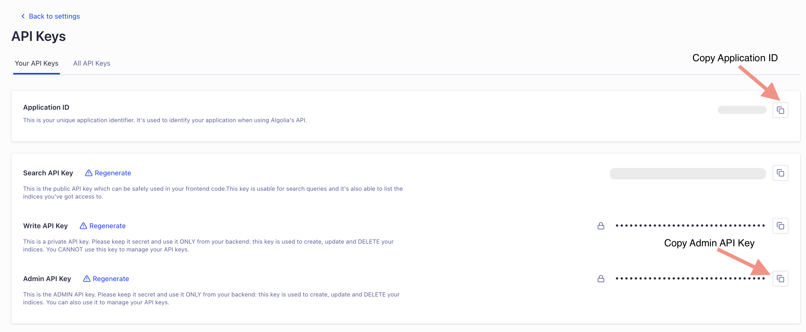
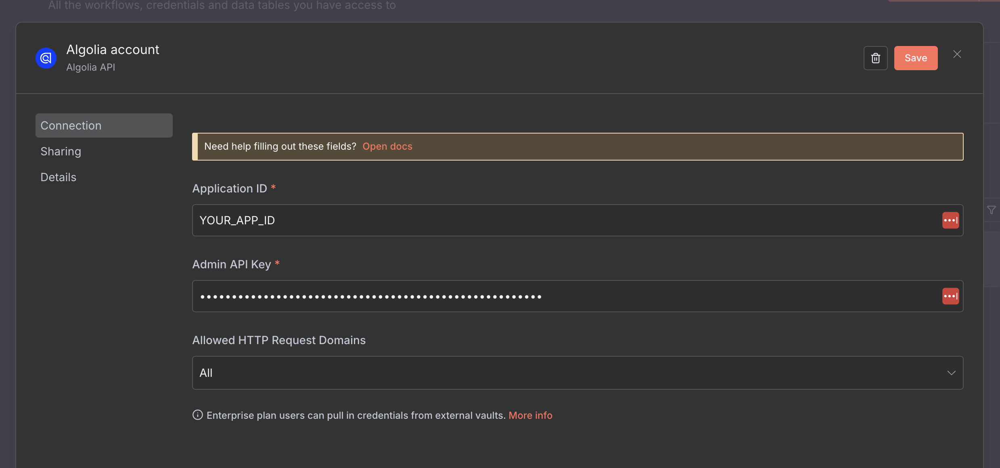
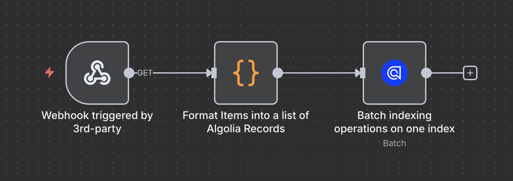
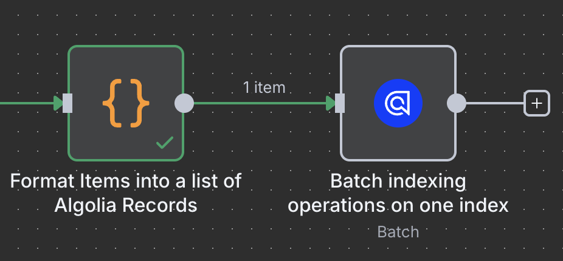
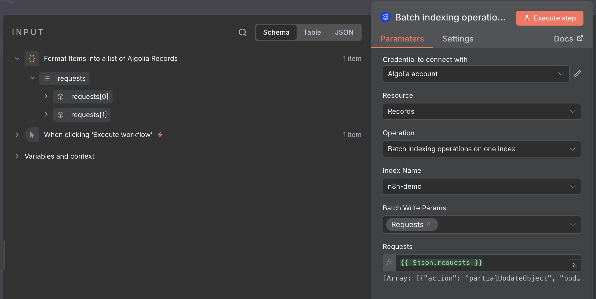
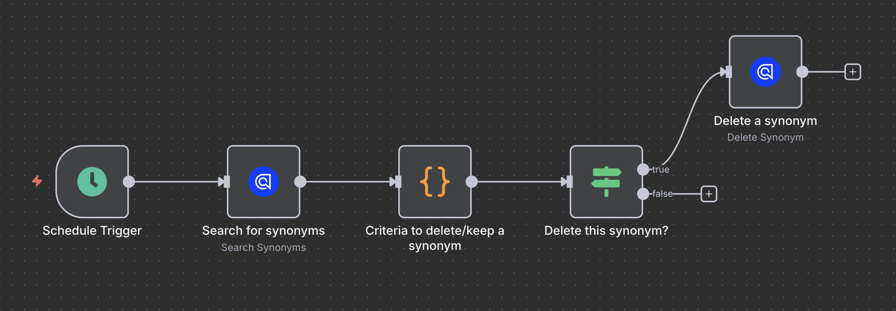

# n8n-nodes-algolia

This is an n8n community node. It lets you use Algolia in your n8n workflows.

Algolia is a hosted search API that provides search-as-a-service solutions. It offers powerful search capabilities including full-text search, faceting, geo-search, and instant search with typo tolerance.

[n8n](https://n8n.io/) is a [fair-code licensed](https://docs.n8n.io/reference/license/) workflow automation platform.

[Installation](#installation)  
[Operations](#operations)  
[Credentials](#credentials)  
[Compatibility](#compatibility)  
[Resources](#resources)

## Installation

Follow the [installation guide](https://docs.n8n.io/integrations/community-nodes/installation/) in the n8n community nodes documentation.

## Credentials

To use this node, you need to authenticate with Algolia using API credentials.

### Prerequisites

1. [Sign up](https://dashboard.algolia.com/users/sign_up) or [log into](https://dashboard.algolia.com/users/sign_in) your Algolia account
2. In your Algolia dashboard, go to [Settings](https://dashboard.algolia.com/account/overview) > [API Keys](https://dashboard.algolia.com/account/api-keys/all)
3. Copy your Application ID
4. Copy your Admin API Key
   - Required for if you want to manage your API keys from n8n - otherwise the Write API Key should be enough)

5. In n8n, create new Algolia API credentials with:
   - **Application ID**: Your Algolia Application ID
   - **Admin API Key**: Your Algolia Admin API Key

## Operations

This node supports the following operations:

<!-- THE FOLLOWING SECTION IS GENERATED BY CI. ANY CHANGES WILL BE OVERRIDDEN -->
<!-- OPERATIONS START -->
### Advanced
- **Retrieve log entries** - The request must be authenticated by an API key with the [`logs` ACL](https://www.algolia.com/doc/guides/security/api-keys/#access-control-list-acl).
- **Check application task status** - Checks the status of a given application task.

### Api Keys
- **List API keys** - Lists all API keys associated with your Algolia application, including their permissions and restrictions.
- **Create an API key** - Creates a new API key with specific permissions and restrictions.
- **Retrieve API key permissions** - Gets the permissions and restrictions of an API key.
- **Update an API key** - Replaces the permissions of an existing API key.
- **Delete an API key** - Deletes the API key.
- **Restore an API key** - Restores a deleted API key.

### Clusters
- **Assign or move a user ID** - Assigns or moves a user ID to a cluster.
- **List user IDs** - Lists the userIDs assigned to a multi-cluster application.
- **Assign multiple userIDs** - Assigns multiple user IDs to a cluster.
- **Get top user IDs** - Get the IDs of the 10 users with the highest number of records per cluster.
- **Retrieve user ID** - Returns the user ID data stored in the mapping.
- **Delete user ID** - Deletes a user ID and its associated data from the clusters.
- **List clusters** - Lists the available clusters in a multi-cluster setup.
- **Search for user IDs** - Since it can take a few seconds to get the data from the different clusters,
- **Get migration and user mapping status** - To determine when the time-consuming process of creating a large batch of users or migrating users from one cluster to another is complete, this operation retrieves the status of the process.

### Dictionaries
- **Add or delete dictionary entries** - Adds or deletes multiple entries from your plurals, segmentation, or stop word dictionaries.
- **Search dictionary entries** - Searches for standard and custom dictionary entries.
- **Retrieve dictionary settings** - Retrieves the languages for which standard dictionary entries are turned off.
- **Update dictionary settings** - Turns standard stop word dictionary entries on or off for a given language.
- **List available languages** - Lists supported languages with their supported dictionary types and number of custom entries.

### Indices
- **Delete an index** - Deletes an index and all its settings.
- **Retrieve index settings** - Retrieves an object with non-null index settings.
- **Update index settings** - Update the specified index settings.
- **Check task status** - Checks the status of a given task.
- **Copy or move an index** - Copies or moves (renames) an index within the same Algolia application.
- **List indices** - Lists all indices in the current Algolia application.

### Records
- **Add a new record (with auto-generated object ID)** - Adds a record to an index or replaces it.
- **Retrieve a record** - Retrieves one record by its object ID.
- **Add or replace a record** - If a record with the specified object ID exists, the existing record is replaced.
- **Delete a record** - Deletes a record by its object ID.
- **Delete records matching a filter** - This operation doesn't accept empty filters.
- **Delete all records from an index** - Deletes only the records from an index while keeping settings, synonyms, and rules.
- **Add or update attributes** - Adds new attributes to a record, or updates existing ones.
- **Batch indexing operations on one index** - Adds, updates, or deletes records in one index with a single API request.
- **Batch indexing operations on multiple indices** - Adds, updates, or deletes records in multiple indices with a single API request.
- **Retrieve records** - Retrieves one or more records, potentially from different indices.

### Rules
- **Retrieve a rule** - Retrieves a rule by its ID.
- **Create or replace a rule** - If a rule with the specified object ID doesn't exist, it's created.
- **Delete a rule** - Deletes a rule by its ID.
- **Create or update rules** - Create or update multiple rules.
- **Delete all rules** - Deletes all rules from the index.
- **Search for rules** - Searches for rules in your index.

### Search
- **Search an index** - Searches a single index and returns matching search results as hits.
- **Search multiple indices** - Sends multiple search requests to one or more indices.
- **Search for facet values** - Searches for values of a specified facet attribute.
- **Browse for records** - Retrieves records from an index, up to 1,000 per request.

### Synonyms
- **Retrieve a synonym** - Retrieves a synonym by its ID.
- **Create or replace a synonym** - If a synonym with the specified object ID doesn't exist, Algolia adds a new one.
- **Delete a synonym** - Deletes a synonym by its ID.
- **Create or replace synonyms** - If a synonym with the `objectID` doesn't exist, Algolia adds a new one.
- **Delete all synonyms** - Deletes all synonyms from the index.
- **Search for synonyms** - Searches for synonyms in your index.

### Vaults
- **List allowed sources** - Retrieves all allowed IP addresses with access to your application.
- **Replace allowed sources** - Replaces the list of allowed sources.
- **Add a source** - Adds a source to the list of allowed sources.
- **Delete a source** - Deletes a source from the list of allowed sources. 
 <!-- OPERATIONS END -->

## Usage examples

### Batch insert into an Algolia Index

This section demonstrates how to efficiently perform batch inserts into an Algolia index using n8n.

Batch operations are ideal for processing large datasets, as they reduce latency and improve data consistency.

<i>Example of a Batch indexing operation workflow</i>

**Step-by-step guide:**

1. Add a **webhook node** or a third-party webhook trigger node to initiate your workflow.

2. Utilize a **Code node** (JavaScript or Python) to format your data for the Algolia batch insert operation.
   - If your items already have unique identifiers, assign them to the `objectID` property.
   - If not, Algolia will automatically generate a unique `objectID` when using the `addObject` or `partialUpdateObject` actions.
   - To remove a record, use the `deleteObject` action.
   - For a complete overview of available actions, refer to the [official documentation](https://www.algolia.com/doc/rest-api/search/batch#body-requests).

3. Add the Algolia node for **Batch indexing operations on one index** and connect it to your data list. As a best practice, ensure that only one item at a time enters this node.

4. Activate the workflow to begin automated batch indexing.

Now, when items are added/deleted from your 3pr-party software, this workflow will make sure your index stays fresh and up to date!

_API Rate limitations apply. See https://www.algolia.com/doc/guides/scaling/algolia-service-limits for more details._

### Scheduled Cleanup of Deprecated Synonyms

Over time, synonyms in your Algolia index might become outdated or no longer needed. With n8n, you can automate the removal of deprecated or unused synonyms to keep your index clean and relevant.

<i>Example of a Batch indexing operation workflow</i>

**Step-by-step guide:**

1. Use the **Schedule trigger** node to schedule the cleanup to run regularly (daily, weekly, etc.).
2. Add the Algolia node to **"Search for synonyms"** in your target index.
3. Use a code node to filter synonyms that match your criteria for deprecation or removal (for example, a custom `deprecated` tag or certain naming patterns).
4. For each deprecated synonym, add an Algolia node to **"Delete a synonym"** by its ID.

This workflow helps ensure your Algolia synonyms stay accurate and up to date.

_API Rate limitations apply. See https://www.algolia.com/doc/guides/scaling/algolia-service-limits for more details._

## Compatibility

This node requires n8n version 1.0.0 or higher and Node.js 20.15 or higher.

## Resources

- [n8n community nodes documentation](https://docs.n8n.io/integrations/#community-nodes)
- [Algolia API documentation](https://www.algolia.com/doc/rest-api/search)
- [Algolia dashboard](https://www.algolia.com/apps)
